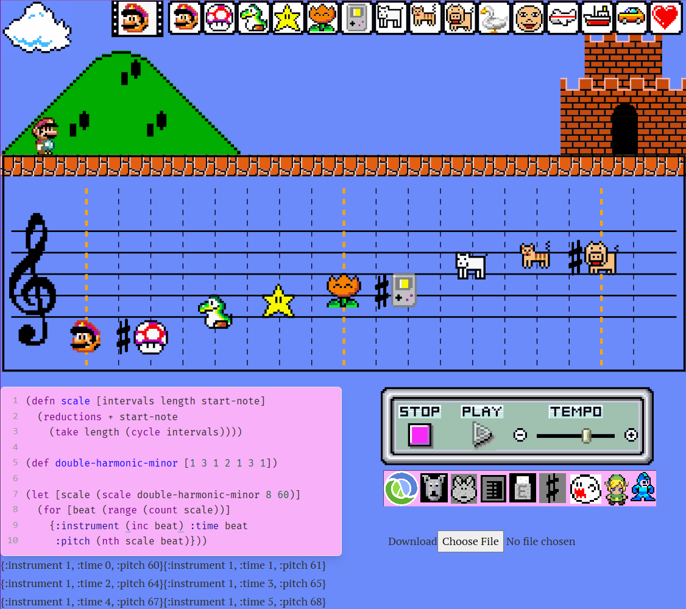

# MECCA Music Platform

The Music Education, Composition, Creation Application

MECCA is a sample-based music editor inspired by Mario Paint written in Clojurescript and re-frame.

It was originally meant to be a chiptune tracker that would simply emulate the 4 channels of the NES. But then I started playing around with alternative interfaces and while working on an SVG music notation rendering engine I realized that my priorities were definitely out of whack, and what my program really needed was a jumping Mario.

I found that the specific subset of musical features used in the Mario Paint music maker provides a delightful scope of creative possibilities while remaining very approachable. And by using styled note samples of equal duration a whole set of elements to implement goes away, like rests, stems, beams, and the need for multiple staves for each voice.

Check out the paper [Mario Paint: An Accessible Environment of Musical Creativity
and Sound Exploration](docs/Mario_Paint_An_Accessible_Environment_of.pdf).

[Live app in its current state](https://porkostomus.github.io/mecca/)



The text representing your music data is accessible down below Data-Robot. It's a sequence of Clojure maps, one for each note. Copy and paste it into your favorite text editor to save your composition. Actual save function coming soon.

## Progress

Implemented [Undodog](https://www.mariowiki.com/Undodog) and Redorabbit. The second one I made up. Actually I think it's supposed to be a frog but whatevs.

Added a sharp button, expanding it to all 12 chromatic tones. Editor scrolls mostly right. Animation... not so much.

Currently working on MusicXML import feature. That means I had to actually use proper midi-numbers which broke the Mario Ghost House theme and Zelda Overworld sample songs. Which will be fine once I'm done because then we'll be able to import any number of songs.

I'm able to parse a score into proper note data, the current challenge is to provide effective import options for instrument selection for the various parts. This is very exciting because I can already sense the hilarity that is to ensue from this feature.

## Future ideas

It would be cool to be able to record, link or upload your own samples. However, when [Koji Kondo](https://en.wikipedia.org/wiki/Koji_Kondo) said that composing for the SNES is 1000 times harder than composing for the NES, he was warning us about the problem of the choose-a-phone. The SNES being sample based can sound like anything, but the NES only plays one set of built-in sounds.

As Rich Hickey [said](https://github.com/matthiasn/talk-transcripts/blob/master/Hickey_Rich/DesignCompositionPerformance.md), "no one, I bet, wants to compose for a choose-a-phone ensemble".

So how can we expand the sonic pallet without turning it into a choose-a-phone?

This question goes right to the heart of a creative platform's design philosophy, and the idea is to subtly encourage the use of musical idioms while maintaining maximal expressivity.

One idea is to make an 8-bit / 16-bit switch that will transform the whole UI respectively from synth oscillator to sample mode.

For the synths, I believe that by using the very efficient algorithms from Blargg's [blip-buf](https://github.com/nesbox/blip-buf) library, a full emulation can be done in the browser quite easily. Since the [NES APU](https://wiki.nesdev.com/w/index.php/APU) produces sound via a [sample/hold](https://en.wikipedia.org/wiki/Sample_and_hold) circuit, it is only necessary to generate the ends of the waveforms (the transitions) since the middle part is the same regardless of frequency, differing only in length.

* Noise channel produces pseudo-random bits by [linear feedback shift register](https://en.wikipedia.org/wiki/Linear-feedback_shift_register) method. This is then played back at 16 possible sample rates. A much shorter bit sequence is also possible, which produces a metallic tone.

* Triangle wave (for bass and kick drums) is actually a 16 step quantized triangle-ish wave with a slight shark fin shape that also has tiny sawteeth on it. Gotta get this stuff right.

* Linear-interpolated bandlimiting will be good enough, since we have the ability to use the hardware clock exposed by the Web Audio API to oversample at an extremely high rate, supressing aliasing far below perceptible limits.

Also very exciting is the possibility of an SVG pixel art / animation studio. Like the way it was in Mario Paint but more better because stuff like custom color pallets, upload your own coloring books, etc.

## Start local development server:

```
clojure -A:fig -b dev -r
```

You'll probably need to change the line in `music.cljs` to point to the directory with the samples:

```
(defn load-samples []
  (go-loop [result {}
            sounds (range 1 27)]
    (if-not (nil? (first sounds))
      (let [sound (first sounds)
            decoded-buffer (<! (get-and-decode {:url (str "/audio/" sound ".mp3")
                                                :sound sound}))]
        (prn sound)
        (prn decoded-buffer)
        (recur (assoc result sound decoded-buffer)
               (rest sounds)))
      result)))
```

## Compile with advanced optimizations:

```
clj -m figwheel.main -O advanced -bo dev
```

Thanks to [Bruce Hauman](https://github.com/bhauman), [Chris Ford](https://github.com/ctford) and [Dave Yarwood](https://github.com/daveyarwood) for blazing the CLJS Web Audio trail. No way I could have figured this all out.
